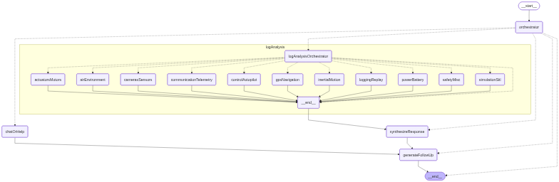

# Chatbot feature

## Getting started

-   Follow `Build Setup` below to start UI
-   In a seperate terminal, start API: `cd api && npm start`
-   Open chatbot from widgets:
    -   Load flight log data
    -   Click (...) to show widgets
    -   Click 'AI assistant' widget

## Feature overview

-   After uploading a UAV flight log or loading the sample:
    -   A stable sessionId is generated based on a hash of the log data
    -   Log data is uploaded as a multipart/form-data file to the server using the sessionId in the filename. See [log documentation](./api/src/handlers/agent/prompts/logDocumentation.js) for details on the available data fields
    -   Both `*.tlog` MavLink files for and `*.bin` Dataflash files are supported and can be analyzed
    -   After storing log data, a pre-processing step is triggered to collect statistical info and relevant documentation for the log file in the background and saved to the server. All numerical series within the above flight log data are analyzed using `simple-statistics`. Descriptional statistics include: count, mean, std, min, median, max, and variance. When associated time data is parsed, time-series statistics are included: slope (regression.m), intercept (regression.b) and r2.
-   On the UI, after click the chat widget a [deep-chat](https://deepchat.dev) session is started with a connection to the API using the current sessionId
-   Chat functionality includes:
    -   Flight log analysis: Depending on the user query, the chat workflow identify all relevant subparts within the available log data to analyze. It then uses a MapReduce workflow to dispatch subagents to generate answers for each subpart, each using the minimal context of relevant subparts of log data, their documentation, and their precomputed statistics. Responses from subagents are then synthesized into a final response and returned to the user.
    -   Query types: This workflow is designed to very simple while generalizing to both narrow queries (e.g. querying only one or two subparts of a log file) as well as high-level queries like anomaly detection (e.g. querying all subparts of the logfile).
    -   Follow up question or clarification: After synthesizing a response, a relevant follow-up question to explore the data more or to further clarifiy user intent is appended to the output.
    -   Help: Users can also ask questions about the chat functionality or the flight data schema, which is answered with documentation dynamically added to the prompt.
    -   Out-of-domain questions: Questions outside of the domain of flight log data analyses or MAVLink documentation can still be answered, but will have a disclaimer string `[LLM: verify]` appended to the response.

## Chat agent workflow

The chat workflow uses [langgraph](https://www.langchain.com/langgraph) to manage agent orchestration. Currently `gpt-4.1-mini` is being used throughout, but tradeoffs can be made for using better reasoning models with slower responses if desired.

The top-level graph in the chat workflow follows an [orchestrator-worker pattern](https://docs.langchain.com/oss/python/langgraph/workflows-agents#orchestrator-worker) with an additional step to add a follow up question.

The top-level orchestrator returns a [structured output](https://docs.langchain.com/oss/javascript/langchain/structured-output#structured-output) following a schema that containing a relevancy score between 0-1 to conditionally determine which nodes to invoke:

```
{
    logAnalysis: <float between 0 and 1>,
    chatOrHelp: <float between 0 and 1>
}
```


The nested `logAnalysis` subgraph follows a [routing pattern](https://docs.langchain.com/oss/python/langgraph/workflows-agents#routing) to dynamically process relevant parts of the log data in parallel.

The nested `logAnalysis` orchestrator returns a [structured output](https://docs.langchain.com/oss/javascript/langchain/structured-output#structured-output) following a schema that containing a relevancy score between 0-1 to conditionally determine which nodes to invoke:

```
{
    "inertialMotion": <float between 0 and 1>,
    "gpsNavigation": <float between 0 and 1>,
    "controlAutopilot": <float between 0 and 1>,
    "actuatorsMotors": <float between 0 and 1>,
    "airEnvironment": <float between 0 and 1>,
    "simulationSitl": <float between 0 and 1>,
    "communicationTelemetry": <float between 0 and 1>,
    "loggingReplay": <float between 0 and 1>,
    "powerBattery": <float between 0 and 1>,
    "camerasSensors": <float between 0 and 1>,
    "safetyMisc": <float between 0 and 1>
}
```



(Blurry png seems to be a known limitation with the nodejs langgraph package)

## Example of pre-processed stats and context

`*.bin` stats and context data snippet

```json
{
    "controlAutopilot": {
        "ATT": [
            {
                "data_key": "DesPitch",
                "description": "vehicle desired pitch (Unit: deg)",
                "stats": {
                    "count": 90348,
                    "mean": 0.00748118386682605,
                    "std": 0.012099196071873703,
                    "min": 0,
                    "max": 0.42,
                    "median": 0.01,
                    "q25": 0,
                    "q75": 0.01,
                    "trend": {
                        "slope": 5.091439526635709e-8,
                        "intercept": 0.0014686796504425424,
                        "r2": 0.07528450437386824
                    }
                },
                "rawData": "ommitted"
            }
        ]
    }
}
```

`*.tlog` stats and context data snippet

```json
{
    "gpsNavigation": {
        "GPS_RAW_INT": [
            {
                "data_key": "alt",
                "description": "Altitude (MSL) (Unit: mm)",
                "stats": {
                    "count": 799,
                    "mean": 611922.0650813517,
                    "std": 18753.86315121873,
                    "min": 586640,
                    "max": 644480,
                    "median": 623220,
                    "q25": 587850,
                    "q75": 626300,
                    "trend": {
                        "slope": -0.10239560634146494,
                        "intercept": 623002.6209506687,
                        "r2": 0.10018632499952063
                    }
                },
                "rawData": "omitted"
            }
        ]
    }
}
```

## Future work

-   Add unit tests and E2E tests
-   Feature idea: analyze how flight data adheres to flight regulation codes
-   Store chat in local storage and include 'clear' button
-   Store log data in DB instead of disk storage on server
-   Fix security issues from adding new packages to repo with outdated dependencies

---

# UAV Log Viewer


This is a Javascript based log viewer for Mavlink telemetry and dataflash logs.
[Live demo here](http://plot.ardupilot.org).

## Build Setup

```bash
# initialize submodules
git submodule update --init --recursive

# install dependencies
npm install

# enter Cesium token
export VUE_APP_CESIUM_TOKEN=<your token>

# serve with hot reload at localhost:8080
npm run dev

# build for production with minification
npm run build

# run unit tests
npm run unit

# run e2e tests
npm run e2e

# run all tests
npm test
```

# Docker

run the prebuilt docker image:

```bash
docker run -p 8080:8080 -d ghcr.io/ardupilot/uavlogviewer:latest

```

or build the docker file locally:

```bash

# Build Docker Image
docker build -t <your username>/uavlogviewer .

# Run Docker Image
docker run -e VUE_APP_CESIUM_TOKEN=<Your cesium ion token> -it -p 8080:8080 -v ${PWD}:/usr/src/app <your username>/uavlogviewer

# Navigate to localhost:8080 in your web browser

# changes should automatically be applied to the viewer

```
